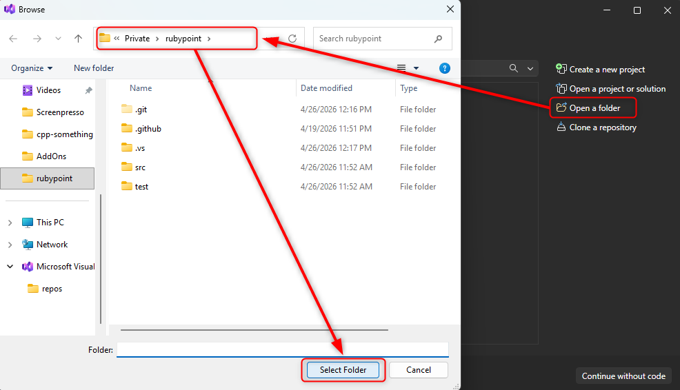
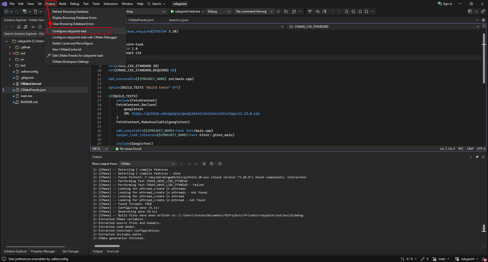
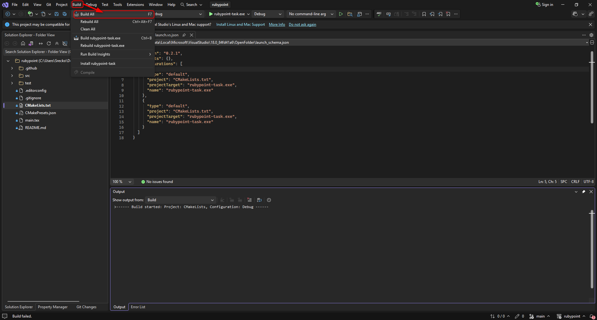
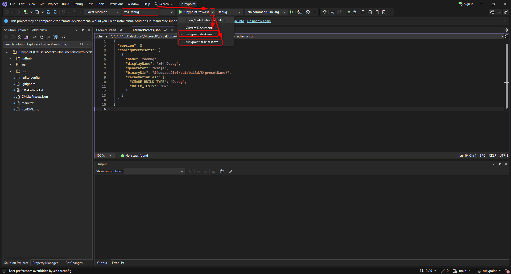

# Rubypoint Task

The Rubypoint task.

## Documentation

The documentation for the Rubypoint task. This project was developed on Windows 11.

### CMake

Make sure to get CMake for your OS.

[CMake download](https://cmake.org/download/).

Used CMake version for this project: `3.24`. _(Was already available on my system.)_

### Visual Studio

**_Note: Tested and implemented with Visual Studio Community 2026._**

How to open the project using visual studio.

#### `File` -> `Open` -> `Folder`

The Visual Studio natively supports CMake.

[CMake support in Visual Studio](https://devblogs.microsoft.com/cppblog/cmake-support-in-visual-studio/).

This method should work with a Visual Studio 2017 and onwards. Otherwise, read on.

### CMake generators

CMake may generate project which Visual Studio may understand. For the list of supported generators, open the link below.

[cmake-generators(7)](https://cmake.org/cmake/help/latest/manual/cmake-generators.7.html#visual-studio-generators)

Make sure to have the Visual Studio which matches the CMake generator which you want to use.

On my Windows 11 OS, running `cmake --help`, listed the following generators:

```powershell
  Visual Studio 17 2022        = Generates Visual Studio 2022 project files.
                                 Use -A option to specify architecture.
  Visual Studio 16 2019        = Generates Visual Studio 2019 project files.
                                 Use -A option to specify architecture.
  Visual Studio 15 2017 [arch] = Generates Visual Studio 2017 project files.
                                 Optional [arch] can be "Win64" or "ARM".
  Visual Studio 14 2015 [arch] = Generates Visual Studio 2015 project files.
                                 Optional [arch] can be "Win64" or "ARM".
  Visual Studio 12 2013 [arch] = Generates Visual Studio 2013 project files.
                                 Optional [arch] can be "Win64" or "ARM".
  Visual Studio 11 2012 [arch] = Generates Visual Studio 2012 project files.
                                 Optional [arch] can be "Win64" or "ARM".
  Visual Studio 10 2010 [arch] = Deprecated.  Generates Visual Studio 2010
                                 project files.  Optional [arch] can be
                                 "Win64" or "IA64".
  Visual Studio 9 2008 [arch]  = Generates Visual Studio 2008 project files.
                                 Optional [arch] can be "Win64" or "IA64".
```

### Build project

Steps how to generate the project.

#### CMake steps

Set of steps to build and run via command line.

##### If you want to simply build and run the source:

Generate the project:

```powershell
cmake -B build -DCMAKE_EXPORT_COMPILE_COMMANDS=ON -S .
```

Build the project:

```powershell
cmake --build build
```

Run the binary:

```powershell
./build/rubypoint-task-app
```

##### If you want to build and run the tests:

Generate the project with tests:

```powershell
cmake -B build -DCMAKE_EXPORT_COMPILE_COMMANDS=ON -DBUILD_TESTS=ON -S .
```

Build the project:

```powershell
cmake --build build
```

Run the tests:

```powershell
./build/rubypoint-task-test
```

#### Visual Studio steps

A set of steps to open, build and run via Visual Studio.

##### If you visit a project on GitHub

Open project:



Configure project:



Build all:



Run the source or test binary:



##### If you don't open the GitHub repository with images

Open Visual Studio, then press `Open a folder`, and find the path to the folder you want to open. Press `Select Folder`.

Find `Project` at the top left menu bar, then press `Configure <project-name>`. This should generate `out` directory with relevant configuration.

Find `Build` at the top left menu bar, to the right of `Project`, then press `Build All`. This ensures source and test binaries are built.

Make sure `x64 Debug` preset is selected, and where green triangle with the binary name is, `rubypoint-task.exe`, click the dropdown icon, you should find `rubypoint-task-app.exe` and `rubypoint-task-test.exe`. Select whichever you want to run, it will close a dropdown. Then, just press the green triangle with the name of the selected build target.

Hopefully, everything worked, and the project builds fine.

### Math in latex document

The latex file is automatically built to pdf via github workflow, the file may be found [on github actions page](https://github.com/srele96/rubypoint-task/actions)

I used [Overleaf](https://www.overleaf.com) to write and review latex in real time.

To compile latex to pdf, you will need [Docker](https://docs.docker.com/desktop/setup/install/windows-install/) installed.

Run the following command from `powershell`:

```powershell
docker run --rm -v "${pwd}:/workdir" texlive/texlive pdflatex main.tex
```

_You can compile it using other cross-platform tools, but Docker was the most convenient for me._

### Desmos

I used desmos to visualize the Triple Scalar Product formula.

You may find the [Triple Scalar Product 3D Desmos graph here](https://www.desmos.com/3d/txxmz6pgxy).
